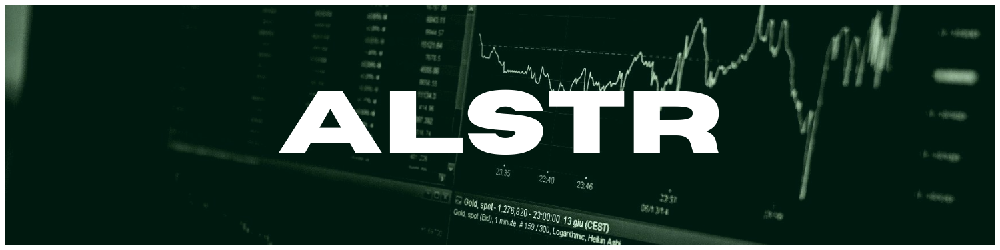
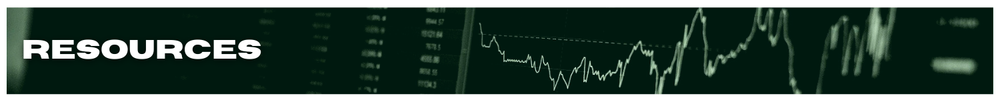

| RESEARCH            | DEVELOPMENT                  |
| ------------------- | ---------------------------- |
| <li>- [ ] li 1</li> | <ul><li>- [ ] li 1</li></ul> |
| - [ ] li 2          | - [ ] li 2                   |

## **RESEARCH**

- [ ] algo-trading strategies
- [ ] algo-trading architecture
- [ ] market data sources
- [ ] brokerage options
- [ ] cloud hosting options (capabilites vs. cost)

## **DEVELOPMENT**

### _Backtesting_

- [ ] fetch historical stock market data
- [ ] store historical market data
- [ ] backtest strategy using historical market data
- [ ] generate backtesting P&L reports

### _Forward Testing_

- [ ] stream real-time market data
- [ ] store real-time market data
- [ ] forward test strategy using real-time market data
- [ ] generate forward testing P&L reports

### _Strategy Execution_

- [ ] run strategy against real-time market data
- [ ] execute orders based on strategy entry/exit triggers
- [ ] send push notifications to assigned devices
- [ ] generate P&L reports for executed orders

### _Strategy Management_

- [ ] admin GUI (desktop, mobile, web)

Alpaca trading [API](https://alpaca.markets/)

- Node.js [SDK](https://github.com/alpacahq/alpaca-trade-api-js)
- historical market data [methods](https://github.com/alpacahq/alpaca-trade-api-js#data-api)

Better Trading System

- [YouTube channel]()
- [podcast]()

Bloom Trading

- [Foundational Stock Trading Course]()
- [Advanced Stock Trading Course]()

[Interactive Brokers](https://www.interactivebrokers.com/en/home.php) Trading Platform

- [getBarsV2()](https://github.com/alpacahq/alpaca-trade-api-js/blob/e323991fa6fc0e629ffc52514a009f2a9b24ce31/lib/resources/datav2/rest_v2.ts#L241) returns AlpacaBar [AsyncGenerator](https://developer.mozilla.org/en-US/docs/Web/JavaScript/Reference/Global_Objects/Generator) via [function\*](https://developer.mozilla.org/en-US/docs/Web/JavaScript/Reference/Statements/function*) getBars()
