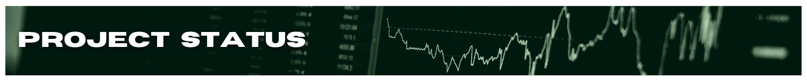

## **OBJECTIVE**

Build a scalable algorithmic trading strategy from scratch.

## **MVP FUNCTIONALITY**

- backtesting capabilities
- basic P&L reporting for both backtesting & live trading
- live-trade one strategy using streaming market data

<h2 id='project-status' align='center'>
  
</h2>

### **_Research_**

- [ ] algo trading system architectures
- [ ] cloud resource options (capabilites vs. cost)
- [ ] brokerage options
- [ ] market data resources

<h2 id='resources' align='center'>
  
</h2>
